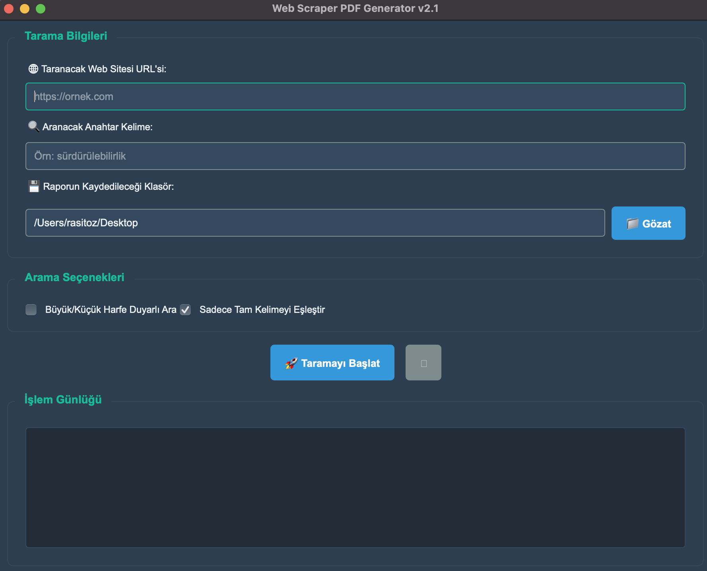

# 🕷️ Web Scraper PDF Generator

[](https://www.python.org/downloads/)
[](https://pypi.org/project/PyQt5/)
[](https://opensource.org/licenses/MIT)
[](https://github.com/your-username/web-scraper-pdf-generator)

<div align="center">
  
</div>

---

## 📄 License

This project is licensed under the [MIT License](LICENSE).

---

## 🌍 Language / Dil

**[🇺🇸 English](#english)** | **[🇹🇷 Türkçe](#türkçe)**

---

## English

### 📖 Overview

A powerful desktop application built with **Python** and **PyQt5** that intelligently scrapes websites for specific keywords and generates comprehensive PDF reports. The application features advanced search capabilities, professional reporting, and full Turkish character support.

### ✨ Features

- **🎨 User-Friendly Interface**: Clean and intuitive GUI built with PyQt5
- **🎯 Targeted Scraping**: Efficiently scrapes any URL for specific keywords
- **🔍 Advanced Search Options**: Case-sensitive and whole-word matching
- **📄 Professional PDF Reports**: Generate clean, detailed PDF summaries
- **🎪 Contextual Matches**: Highlights matches within surrounding text
- **🇹🇷 Turkish Character Support**: Full support for Turkish characters (ç, ğ, ı, ö, ş, ü)
- **⚡ Asynchronous Operation**: Non-blocking UI with threaded scraping
- **📊 Progress Tracking**: Real-time operation logs and progress updates

### 🛠️ Prerequisites

- **Python 3.7+**
- **Internet connection** for web scraping
- **DejaVu Sans font files** (setup instructions below)

### 📦 Installation

#### 1. Clone the Repository

```bash
git clone https://github.com/ichrasit/web-scraper-pdf-generator.git
cd web-scraper-pdf-generator
```

#### 2. Create Virtual Environment

```bash
# Windows
python -m venv venv
.\venv\Scripts\activate

# macOS / Linux
python3 -m venv venv
source venv/bin/activate
```

#### 3. Install Dependencies

```bash
pip install -r requirements.txt
```

#### 4. Setup Font Assets ⚠️ **CRITICAL STEP**

> **Important:** This step is essential for proper PDF generation with Turkish characters.

1. Create an `assets` folder in the project root directory
2. Download [DejaVu Sans font](https://dejavu-fonts.github.io/Download.html) 
3. Extract and copy the following files to the `assets` folder:
   - `DejaVuSans.ttf`
   - `DejaVuSans-Bold.ttf`

**Expected project structure:**
```
your-repository/
├── assets/
│   ├── DejaVuSans.ttf
│   └── DejaVuSans-Bold.ttf
├── src/
├── requirements.txt
└── main.py
```

### 🚀 Usage

1. **Launch the application:**
   ```bash
   python main.py
   ```

2. **Configure your scan:**
   - Enter the target website URL
   - Specify your search keyword
   - Select output folder for PDF report
   - Choose search options (case-sensitive, whole word)

3. **Start scanning:**
   - Click "Start Scan" button
   - Monitor progress in the log area
   - PDF report will be generated automatically

### 📋 Requirements

Create a `requirements.txt` file with the following dependencies:

```txt
PyQt5>=5.15.0
beautifulsoup4>=4.9.0
requests>=2.25.0
reportlab>=3.5.0
lxml>=4.6.0
```

### 📸 Screenshots

<div align="center">
  
  <p><em>Main application interface</em></p>
</div>

### 🤝 Contributing

Contributions are welcome! Please feel free to submit a Pull Request.

1. Fork the project
2. Create your feature branch (`git checkout -b feature/AmazingFeature`)
3. Commit your changes (`git commit -m 'Add some AmazingFeature'`)
4. Push to the branch (`git push origin feature/AmazingFeature`)
5. Open a Pull Request

### 📄 License

This project is licensed under the MIT License - see the [LICENSE](LICENSE) file for details.

### 🐛 Issues

If you encounter any issues, please [create an issue](https://github.com/ichrasit/web-scraper-pdf-generator/issues) with detailed information.

### 📞 Support

For support, please contact [your-email@example.com](mailto:ozrasit@icloud.com) or create an issue.

---

## Türkçe

### 📖 Genel Bakış

**Python** ve **PyQt5** ile geliştirilmiş, web sitelerini belirli anahtar kelimeler için akıllıca tarayan ve kapsamlı PDF raporları oluşturan güçlü bir masaüstü uygulamasıdır. Uygulama, gelişmiş arama özellikleri, profesyonel raporlama ve tam Türkçe karakter desteği sunar.

### ✨ Özellikler

- **🎨 Kullanıcı Dostu Arayüz**: PyQt5 ile oluşturulmuş temiz ve sezgisel GUI
- **🎯 Hedefli Tarama**: Belirli anahtar kelimeler için herhangi bir URL'yi verimli tarama
- **🔍 Gelişmiş Arama Seçenekleri**: Büyük/küçük harf duyarlı ve tam kelime eşleştirme
- **📄 Profesyonel PDF Raporları**: Temiz, detaylı PDF özetleri oluşturma
- **🎪 Bağlamsal Eşleşmeler**: Eşleşmeleri çevresindeki metinle birlikte vurgulama
- **🇹🇷 Türkçe Karakter Desteği**: Türkçe karakterler (ç, ğ, ı, ö, ş, ü) için tam destek
- **⚡ Asenkron Çalışma**: Thread'li tarama ile engellemeyen UI
- **📊 İlerleme Takibi**: Gerçek zamanlı işlem logları ve ilerleme güncellemeleri

### 🛠️ Gereksinimler

- **Python 3.7+**
- **Internet bağlantısı** web tarama için
- **DejaVu Sans font dosyaları** (kurulum talimatları aşağıda)

### 📦 Kurulum

#### 1. Depoyu Klonlayın

```bash
git clone https://github.com/ichrasit/web-scraper-pdf-generator.git
cd web-scraper-pdf-generator
```

#### 2. Sanal Ortam Oluşturun

```bash
# Windows
python -m venv venv
.\venv\Scripts\activate

# macOS / Linux
python3 -m venv venv
source venv/bin/activate
```

#### 3. Bağımlılıkları Yükleyin

```bash
pip install -r requirements.txt
```

#### 4. Font Dosyalarını Ayarlayın ⚠️ **KRİTİK ADIM**

> **Önemli:** Bu adım, Türkçe karakterlerle doğru PDF oluşturma için gereklidir.

1. Proje kök dizininde `assets` klasörü oluşturun
2. [DejaVu Sans fontunu](https://dejavu-fonts.github.io/Download.html) indirin
3. Aşağıdaki dosyaları çıkarın ve `assets` klasörüne kopyalayın:
   - `DejaVuSans.ttf`
   - `DejaVuSans-Bold.ttf`

**Beklenen proje yapısı:**
```
proje-adiniz/
├── assets/
│   ├── DejaVuSans.ttf
│   └── DejaVuSans-Bold.ttf
├── src/
├── requirements.txt
└── main.py
```

### 🚀 Kullanım

1. **Uygulamayı başlatın:**
   ```bash
   python main.py
   ```

2. **Taramanızı yapılandırın:**
   - Hedef web sitesi URL'sini girin
   - Arama anahtar kelimenizi belirtin
   - PDF raporu için çıktı klasörünü seçin
   - Arama seçeneklerini seçin (büyük/küçük harf duyarlı, tam kelime)

3. **Taramayı başlatın:**
   - "Taramayı Başlat" düğmesine tıklayın
   - Log alanında ilerlemeyi izleyin
   - PDF raporu otomatik olarak oluşturulacaktır

### 📋 Gerekli Kütüphaneler

`requirements.txt` dosyasını aşağıdaki bağımlılıklarla oluşturun:

```txt
PyQt5>=5.15.0
beautifulsoup4>=4.9.0
requests>=2.25.0
reportlab>=3.5.0
lxml>=4.6.0
```

### 📸 Ekran Görüntüleri

<div align="center">
  
  <p><em>Ana uygulama arayüzü</em></p>
</div>

### 🤝 Katkıda Bulunma

Katkılarınızı bekliyoruz! Lütfen Pull Request gönderebilirsiniz.

1. Projeyi fork edin
2. Özellik dalınızı oluşturun (`git checkout -b feature/HarikaBirOzellik`)
3. Değişikliklerinizi commit edin (`git commit -m 'Harika bir özellik ekle'`)
4. Dalınıza push edin (`git push origin feature/HarikaBirOzellik`)
5. Pull Request açın

### 📄 Lisans

Bu proje MIT Lisansı ile lisanslanmıştır - detaylar için [LICENSE](LICENSE) dosyasına bakın.

### 🐛 Sorunlar

Herhangi bir sorunla karşılaşırsanız, lütfen detaylı bilgiyle [bir issue oluşturun](https://github.com/ichrasit/web-scraper-pdf-generator/issues).

### 📞 Destek

Destek için lütfen [email-adresiniz@example.com](mailto:ozrasit@icloud.com) ile iletişime geçin veya bir issue oluşturun.

---

<div align="center">
  <p>Made with ❤️ by <a href="https://github.com/ichrasit">Your Name</a></p>
  <p>⭐ Bu projeyi beğendiyseniz yıldız vermeyi unutmayın!</p>
</div>
